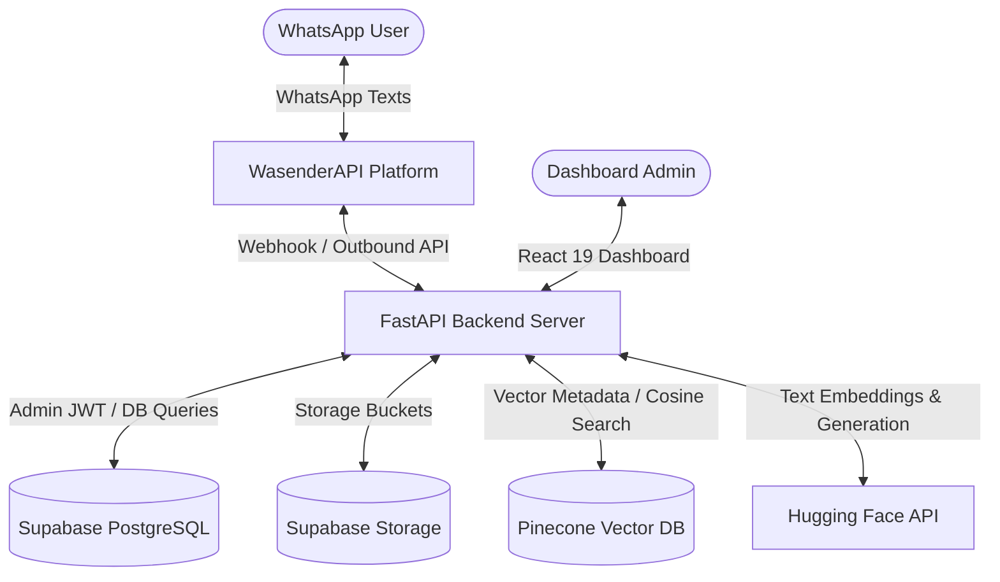

# AI-Powered WhatsApp Chatbot Using RAG

An enterprise-ready, retrieval-augmented generation (RAG) system that connects WhatsApp messaging directly to internal company knowledge repositories. The system features a FastAPI backend orchestrating semantic indexing, a Pinecone vector database, and a React 19 + TypeScript admin dashboard for controlling search weights, prompt engineering, document indexing, and conversation auditing.

---

## System Architecture



---

## 1. Database Schema

The PostgreSQL database (managed via Supabase) contains seven tables. All tables are protected by Row Level Security (RLS) policies requiring admin JWT tokens, except when queried by the backend via the `service_role` key.

### Table: `users`
Tracks authenticated admin administrators.
- `id` (UUID, Primary Key): References `auth.users(id)`.
- `email` (Text, Unique): Admin user email.
- `role` (Text): Defaults to `'admin'`.
- `created_at` / `updated_at` (Timestamps).

### Table: `documents`
Stores metadata of knowledge base files.
- `id` (UUID, Primary Key): Document unique identifier.
- `name` (Text): Filename.
- `storage_path` (Text): Path inside the Supabase Storage bucket.
- `file_type` (Text): `pdf`, `docx`, `csv`, `txt`, `md`.
- `size` (BigInt): File size in bytes.
- `status` (Text): `uploaded`, `processing`, `indexed`, `error`.
- `error_message` (Text, Nullable): Explains indexing failures.
- `chunk_count` (Integer): Total chunks indexed.

### Table: `document_chunks`
Stores parsed blocks of texts associated with vector IDs.
- `id` (UUID, Primary Key).
- `document_id` (UUID): References `documents.id` (ON DELETE CASCADE).
- `content` (Text): The raw slice of text content.
- `chunk_index` (Integer): Sequential block number.
- `vector_id` (Text): Reference ID inside the Pinecone vector index.
- `metadata` (JSONB).

### Table: `chat_sessions`
Identifies unique WhatsApp customer channels.
- `id` (UUID, Primary Key).
- `phone_number` (Text, Unique): WhatsApp phone identifier.
- `session_id` (Text, Unique): Session key.

### Table: `messages`
Stores message transcripts for audit and memory logs.
- `id` (UUID, Primary Key).
- `session_id` (UUID): References `chat_sessions.id`.
- `sender` (Text): `'user'` or `'bot'`.
- `message_id` (Text, Nullable): WhatsApp unique ID.
- `content` (Text): Message body.
- `retrieved_chunks` (JSONB): JSON list of vectors that contributed to the response.

### Table: `system_settings`
Key-value store of RAG configurations.
- `key` (Text, Primary Key): Setting key (e.g. `chunk_size`, `top_k`).
- `value` (JSONB): Setting value.

### Table: `audit_logs`
Logs admin actions for security.
- `id` (UUID, Primary Key).
- `action` (Text): Action tag (e.g. `delete_document`).
- `details` (Text): Change summaries.
- `performed_by` (UUID): References `auth.users.id`.

---

## 2. API Endpoint Specification

### Public Endpoints

#### `GET /health`
Verifies backend server health and checks Supabase/Pinecone connectivity.
*   **Response (200 OK):**
    ```json
    {
      "status": "healthy",
      "database": "connected",
      "vector_store": "connected"
    }
    ```

#### `POST /webhook`
Ingests WhatsApp events from WasenderAPI. Uses `X-Webhook-Signature` for validation.
*   **Headers:** `X-Webhook-Signature: <signature>`
*   **Request Body Example:**
    ```json
    {
      "event": "messages.received",
      "data": {
        "from": "1234567890",
        "text": "What is the return policy?",
        "message_id": "msg_abc123"
      }
    }
    ```
*   **Response (200 OK):** `{"status": "received"}` (processes RAG asynchronously in a background thread to prevent retries).

---

### Protected Endpoints
*Must contain `Authorization: Bearer <Supabase_JWT_Token>` in header.*

#### `GET /auth/verify`
Confirms access token is active.
*   **Response (200 OK):** `{"status": "authenticated", "user": {"id": "...", "email": "..."}}`

#### `GET /documents`
List metadata of all documents.
*   **Response (200 OK):** Array of document objects.

#### `POST /upload-document`
Uploads a file to storage and queues it for background text extraction, chunking, and embedding.
*   **Request Form:** `file` (Binary File: PDF, DOCX, CSV, TXT)
*   **Response (200 OK):**
    ```json
    {
      "status": "success",
      "message": "File uploaded. Indexing has started in the background.",
      "document": { "id": "...", "name": "policy.pdf", "status": "uploaded" }
    }
    ```

#### `DELETE /documents/{id}`
Deletes a document, clears its database logs, and removes related vectors from Pinecone.
*   **Response (200 OK):** `{"status": "success", "message": "Document deleted successfully."}`

#### `POST /reindex`
Wipes and recalculates vector indices for a specific document.
*   **Request Body:** `{"document_id": "uuid-string"}`
*   **Response (200 OK):** `{"status": "success", "message": "Reindexing started."}`

#### `POST /chat`
Simulate a user query from the admin dashboard to inspect vector source output.
*   **Request Body:**
    ```json
    {
      "message": "Does the company offer health insurance?",
      "phone_number": "admin-test-user"
    }
    ```
*   **Response (200 OK):**
    ```json
    {
      "session_id": "...",
      "answer": "Yes, health insurance is provided...",
      "retrieved_chunks": [
        {
          "vector_id": "vec_xyz_0",
          "score": 0.8412,
          "content": "Full health insurance coverage is available for full-time employees...",
          "document_id": "..."
        }
      ]
    }
    ```

#### `GET /chat-history`
Lists active sessions with latest previews.
*   **Response (200 OK):** Array of active sessions.

#### `GET /chat-history/{session_id}/messages`
Chronological messages for a session.
*   **Response (200 OK):** List of messages.

#### `GET /settings` / `POST /settings`
Reads and writes settings (keys are masked).
*   **Response (200 OK):** SystemSettings object.

---

## 3. Installation Guide

### Backend Setup (FastAPI)
1.  **Navigate to backend directory**:
    ```bash
    cd backend
    ```
2.  **Create a python virtual environment**:
    ```bash
    python -m venv venv
    venv\Scripts\activate      # Windows
    source venv/bin/activate   # macOS/Linux
    ```
3.  **Install dependencies**:
    ```bash
    pip install -r requirements.txt
    ```
4.  **Create `.env` file**:
    Copy `env.example` and replace the placeholder values.
    ```bash
    cp .env.example .env
    ```
5.  **Start Development Server**:
    ```bash
    python app/main.py
    ```

### Frontend Setup (Vite + React)
1.  **Navigate to frontend directory**:
    ```bash
    cd frontend
    ```
2.  **Install node packages**:
    ```bash
    npm install
    ```
3.  **Create `.env` file**:
    Copy `env.example` and configure credentials:
    ```bash
    cp .env.example .env
    ```
4.  **Start Development Server**:
    ```bash
    npm run dev
    ```

---

## 4. Webhook Tunneling and Verification

To integrate WasenderAPI webhooks locally:
1.  Run a local tunneling utility (e.g. `ngrok` or `localtunnel`):
    ```bash
    ngrok http 8000
    ```
2.  Copy the forwarded HTTPS URL (e.g. `https://random-id.ngrok-free.app`).
3.  Log in to the **WasenderAPI** dashboard.
4.  Paste `https://random-id.ngrok-free.app/webhook` into your WhatsApp session **Webhook URL** field.
5.  Subscribe to `messages.received` events.
6.  Set a **Webhook Secret** in the Wasender dashboard, and save this secret inside the Admin Dashboard Settings panel (or as `WASENDER_WEBHOOK_SECRET` in your backend `.env`). This secures your API from unauthorized callers.

---

## 5. Production Deployment Guide

### Database (Supabase)
1.  Create a new project on [Supabase](https://supabase.com).
2.  Navigate to the **SQL Editor** in the left menu.
3.  Paste the contents of [supabase_schema.sql](file:///backend/supabase_schema.sql) and execute.
4.  In the Supabase dashboard, create a Storage bucket named `documents` and set it to **Public**.
5.  Copy your **Project URL**, **Anon Key**, and **Service Role Key** (for your backend server environment) from **Project Settings > API**.

### Vector Database (Pinecone)
1.  Sign up on [Pinecone](https://pinecone.io).
2.  Obtain your **API Key**.
3.  Choose a serverless index name (e.g. `whatsapp-rag-index`). You do not need to create it manually; the FastAPI backend will automatically provision it during first upload if it doesn't exist.

### Backend Server (Render or Railway)
1.  Push your code to a GitHub repository.
2.  Create a new Web Service on [Render](https://render.com) or [Railway](https://railway.app).
3.  Set the Root Directory to `backend`.
4.  Configure the build command:
    ```bash
    pip install -r requirements.txt
    ```
5.  Configure the start command:
    ```bash
    uvicorn app.main:app --host 0.0.0.0 --port $PORT
    ```
6.  Add all environment variables from `backend/.env.example`.

### Frontend Dashboard (Vercel)
1.  Add a new project on [Vercel](https://vercel.com) linked to your GitHub repo.
2.  Set the Framework Preset to **Vite**.
3.  Set the Root Directory to `frontend`.
4.  Add environment variables from `frontend/.env.example` pointing to your hosted FastAPI backend.
5.  Click **Deploy**.
